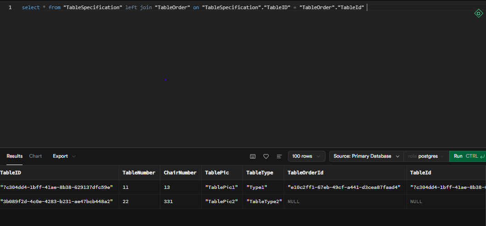
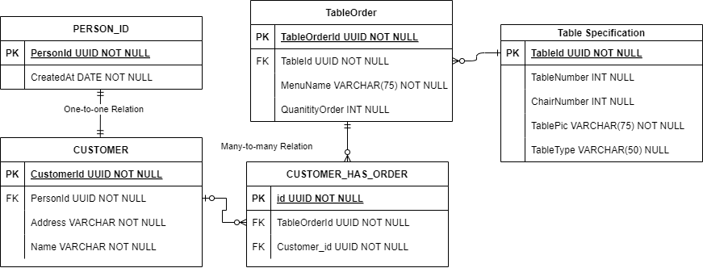

# Bootcamp Day 2 : SQL

## By Afif Haidar

---

### 1. Create table according to ERD and dump data

- Create table `TableSpecification`

  ```sql
  create table
    public."TableSpecification" (
      "TableID" uuid not null default gen_random_uuid (),
      "TableNumber" smallint null,
      "ChairNumber" smallint null,
      "TablePic" character varying not null,
      "TableType" character varying not null,
      constraint TABLE_SPECIFICATION_pkey primary key ("TableID")
    ) tablespace pg_default;
  ```

- Create table `TableOrder`

  ```sql
  create table
    public."TableOrder" (
      "TableOrderId" uuid not null default gen_random_uuid (),
      "TableId" uuid not null default gen_random_uuid (),
      "MenuName" character varying not null,
      "QuantityOrder" smallint null,
      constraint TableOrder_pkey primary key ("TableOrderId"),
      constraint TableOrder_TableId_fkey foreign key ("TableId") references "TableSpecification" ("TableID")
    ) tablespace pg_default;

  ```
- Insert data to `TableSpecification`
  
  ```sql
  INSERT INTO "public"."TableSpecification" ("TableID", "TableNumber", "ChairNumber", "TablePic", "TableType") VALUES ('3b089f2d-4c0e-4283-b231-ae47bcb448a2', '22', '331', 'TablePic2', 'TableType2'), ('7c304dd4-1bff-41ae-8b38-629137dfc59e', '11', '13', 'TablePic1', 'Type1');

  ```
- Insert data to `TableOrder`
  
  ```sql
  INSERT INTO "public"."TableOrder" ("TableOrderId", "TableId", "MenuName", "QuantityOrder") VALUES ('e10c2ff1-67eb-49cf-a441-d3cea87faad4', '7c304dd4-1bff-41ae-8b38-629137dfc59e', 'Menu1', '21');
  ```

### 2. Select all data from table `TableSpecification` 
<!-- attach image -->


### 3. Add one-to-one and many-to-many relations on table `TableSpecification`
